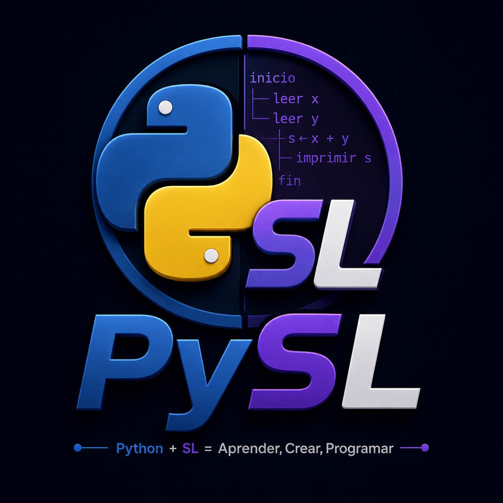

<p align="center">
  
</p>

<h1 align="center">
🐍 PySL
</h1>

<p align="center">
<b>Python + SL = Aprender, Crear, Programar</b>
</p>

<p align="center">
Plataforma educativa de programación inspirada en el lenguaje <b>SL</b> del Instituto Tecnológico de Las Américas (ITLA).
</p>

<p align="center">
 
</p>

<p align="center">


</p>

<p align="center">


</p>

---

# 📖 Descripción

**PySL** es una plataforma educativa de escritorio desarrollada completamente en **Python** utilizando **PySide6**, diseñada para enseñar programación estructurada mediante una sintaxis inspirada en el lenguaje **SL**, utilizado durante la asignatura **Fundamentos de Programación (SOF-001)** del **Instituto Tecnológico de Las Américas (ITLA)**.

Este proyecto representa una **reinterpretación moderna** del proyecto final desarrollado originalmente durante el período académico **2016-C2**.

En lugar de limitarse a reproducir la versión original, PySL amplía significativamente sus capacidades incorporando una arquitectura modular, un entorno gráfico moderno, un editor de código propio, laboratorios interactivos, juegos educativos y persistencia de datos mediante SQLite.

Su objetivo principal es proporcionar un entorno donde los estudiantes puedan aprender programación de forma práctica, visual e interactiva.

---

# 🎯 Objetivos

- Modernizar el proyecto final de **Fundamentos de Programación**.
- Preservar el enfoque educativo del lenguaje **SL**.
- Facilitar el aprendizaje mediante una interfaz gráfica moderna.
- Integrar teoría, práctica y ejercicios dentro de una sola aplicación.
- Servir como proyecto académico y de portafolio profesional.
- Demostrar buenas prácticas de arquitectura y desarrollo de software.

---

# 🏛 Información académica

| Campo | Información |
|:------|:------------|
| **Institución** | Instituto Tecnológico de Las Américas (ITLA) |
| **Autor** | Francis Jairo Matías Rosario |
| **Matrícula** | 2015-2984 |
| **Materia** | Fundamentos de Programación (SOF-001) |
| **Período académico** | 2016-C2 |
| **Profesor** | Freidy Ramón Núñez Pérez |

---

# ✨ Características principales

PySL fue diseñado como una plataforma educativa integral que combina teoría, práctica y programación dentro de una única aplicación de escritorio.

## 🖥️ IDE PySL

El entorno de desarrollo integrado permite crear y ejecutar programas escritos en el lenguaje **PySL**.

### Incluye

- 📝 Editor de código para archivos `.pysl`.
- 🔢 Numeración automática de líneas.
- 🎨 Resaltado de sintaxis.
- ▶️ Ejecución integrada del programa.
- 💻 Consola de salida.
- 📂 Apertura y guardado de proyectos.
- 📋 Interfaz moderna desarrollada con PySide6.

---

## 🐍 Lenguaje PySL

PySL implementa una sintaxis sencilla inspirada en el lenguaje **SL**, utilizada para introducir los fundamentos de la programación estructurada.

Actualmente soporta:

- Variables
- Tipos de datos
- Entrada y salida
- Operadores aritméticos
- Operadores lógicos
- Condicionales
- Ciclos
- Vectores
- Funciones
- Validación sintáctica
- Ejecución mediante Runtime propio

---

## 🔄 Conversor PySL ↔ Python

El sistema incorpora un conversor que facilita comprender la relación entre el pseudocódigo y Python.

Permite:

- Convertir código PySL a Python.
- Comparar ambos lenguajes.
- Facilitar el aprendizaje progresivo.
- Comprender la equivalencia entre instrucciones.

---

## 📚 Curso interactivo

PySL incorpora un módulo educativo orientado al autoaprendizaje.

Incluye contenido sobre:

- Variables
- Tipos de datos
- Operadores
- Condicionales
- Ciclos
- Funciones
- Algoritmos

---

## 🧪 Laboratorios

Los laboratorios permiten poner en práctica los conocimientos adquiridos durante el curso.

Cada laboratorio puede incluir:

- 📖 Explicación del problema.
- 📝 Algoritmo en lenguaje natural.
- 🐍 Implementación en PySL.
- 💻 Conversión a Python.
- ▶️ Ejecución.
- 📊 Resultado obtenido.

---

## 🎮 Juegos educativos

Como complemento al aprendizaje, PySL incorpora una pequeña colección de juegos desarrollados en Python.

Actualmente incluye:

- 🎯 Ahorcado.
- 🔢 Adivina el número.
- ✊ Piedra, Papel o Tijera.
- ❌ Tres en Raya.

Estos juegos permiten reforzar conceptos de programación mientras el estudiante interactúa con la aplicación.

---

## 👤 Gestión del usuario

La plataforma incorpora un sistema local de usuario para personalizar la experiencia.

Características:

- Inicio de sesión demostrativo.
- Perfil de usuario.
- Configuración.
- Preferencias persistentes.
- Historial de progreso.

---

## 💾 Persistencia de datos

Toda la información del usuario se almacena mediante **SQLite**, permitiendo conservar el progreso entre sesiones.

Se almacenan:

- Configuración.
- Preferencias.
- Progreso académico.
- Estadísticas.
- Datos de la aplicación.

---

## 📖 Documentación integrada

PySL incorpora documentación accesible desde la propia aplicación.

Entre los documentos incluidos se encuentran:

- Sintaxis del lenguaje.
- Arquitectura del proyecto.
- Historial de versiones.
- Información académica.
- Acerca de PySL.

---

# 🧰 Tecnologías utilizadas

<p align="center">


</p>

| Tecnología | Uso dentro del proyecto |
|------------|-------------------------|
| 🐍 Python 3.13 | Lenguaje principal del proyecto. |
| 🖥️ PySide6 (Qt) | Desarrollo de la interfaz gráfica de escritorio. |
| 💾 SQLite | Persistencia local de datos y configuración. |
| 🧪 Pytest | Pruebas automatizadas del proyecto. |
| 📦 PyInstaller | Generación del ejecutable para Windows. |
| 🌿 Git | Control de versiones. |
| 🐙 GitHub | Publicación y documentación del proyecto. |

---

# 🏗️ Arquitectura del proyecto

PySL fue desarrollado siguiendo una arquitectura modular que facilita el mantenimiento, la escalabilidad y la incorporación de nuevas funcionalidades.

Cada módulo tiene una responsabilidad específica, reduciendo el acoplamiento entre componentes y favoreciendo la reutilización del código.

```text
                         PySL

                +----------------------+
                |   Interfaz (PySide6) |
                +----------------------+
                           │
        ┌──────────────────┼──────────────────┐
        ▼                  ▼                  ▼

   Dashboard          IDE PySL         Laboratorios

        ▼                  ▼                  ▼

     Juegos         Conversor         Documentación

                   ▼
             Runtime PySL

                   ▼
              Parser PySL

                   ▼
             Base de Datos
                 SQLite
```

La arquitectura separa claramente la interfaz gráfica, la lógica del lenguaje PySL y la persistencia de datos, permitiendo que cada componente evolucione de forma independiente.

---

# 📂 Estructura del repositorio

```text
PySL
│
├── 📁 assets
│   ├── 📁 images
│   └── 📁 videos
│
├── 📁 docs
│   ├── ARQUITECTURA.md
│   ├── SINTAXIS.md
│   └── CHANGELOG.md
│
├── 📁 legacy
│   └── 📁 web-original
│
├── 📁 scripts
│   └── build_windows.ps1
│
├── 📁 src
│   └── 📁 pysl
│       ├── 📁 core
│       ├── 📁 database
│       ├── 📁 modules
│       ├── 📁 runtime
│       ├── 📁 services
│       ├── 📁 ui
│       └── app.py
│
├── 📁 tests
│
├── 📄 README.md
├── 📄 LICENSE
├── 📄 pyproject.toml
└── 📄 .gitignore
```

---

# 📦 Requisitos

Para ejecutar PySL se recomienda el siguiente entorno:

| Requisito | Versión |
|-----------|---------|
| 🐍 Python | 3.13 o superior |
| 💻 Sistema Operativo | Windows 10 / Windows 11 |
| 🧠 Memoria RAM | 4 GB mínimo |
| 💾 Espacio en disco | 300 MB libres |
| 🖥️ Resolución recomendada | 1366×768 o superior |

> **Nota:** Aunque PySL puede ejecutarse en Linux y macOS, la versión actual está optimizada y probada principalmente para Windows.

---

# 🚀 Instalación

## 1️⃣ Clonar el repositorio

```bash
git clone https://github.com/Jairo0811/PySL

cd PySL
```

---

## 2️⃣ Crear el entorno virtual

### Windows

```powershell
py -3.13 -m venv .venv

.\.venv\Scripts\Activate.ps1
```

### Linux / macOS

```bash
python3 -m venv .venv

source .venv/bin/activate
```

---

## 3️⃣ Instalar las dependencias

```powershell
python -m pip install --upgrade pip

python -m pip install -e ".[dev,build]"
```

---

## 4️⃣ Ejecutar las pruebas

```powershell
python -m pytest
```

Si todo está correcto se mostrará un resultado similar a:

```text
=============================

20 passed

=============================
```

---

## ▶️ Ejecutar PySL

```powershell
python -m pysl.app
```

---

## 🔑 Credenciales de demostración

PySL incorpora un sistema de autenticación únicamente con fines demostrativos.

```text
Usuario:

Jairo

Contraseña:

pysl2026
```

> **Importante:** Este sistema de autenticación es local y fue implementado exclusivamente para efectos académicos y de demostración. No debe considerarse un mecanismo de autenticación para entornos de producción.

---

## 🏗️ Generar el ejecutable

```powershell
Unblock-File .\scripts\build_windows.ps1

.\scripts\build_windows.ps1
```

El ejecutable será generado en:

```text
dist/
└── PySL/
    └── PySL.exe
```

Los datos del usuario y la base de datos SQLite se almacenan fuera del directorio de instalación para garantizar que no se pierdan durante futuras actualizaciones.

---

# 🖥️ Módulos de la aplicación

PySL está organizado en módulos independientes, cada uno enfocado en una funcionalidad específica. Esta arquitectura facilita el mantenimiento, la escalabilidad y la incorporación de nuevas características.

---

# 🏠 Dashboard

El Dashboard constituye la pantalla principal de la aplicación.

Desde él es posible acceder rápidamente a todas las funcionalidades de PySL.

### Funciones

- 📊 Panel principal.
- 🚀 Accesos rápidos.
- 👤 Información del usuario.
- 📈 Estado general de la aplicación.
- 🧭 Navegación hacia todos los módulos.

---

# 👤 Perfil

El módulo de perfil permite visualizar la información del usuario que utiliza la aplicación.

### Incluye

- Nombre del usuario.
- Información académica.
- Configuración personal.
- Preferencias del sistema.

---

# 🐍 IDE PySL

El IDE es el núcleo principal de la plataforma.

Permite escribir, editar y ejecutar programas desarrollados en el lenguaje **PySL**.

## Características

- 📝 Editor para archivos `.pysl`.
- 🔢 Numeración automática de líneas.
- 🎨 Resaltado de sintaxis.
- 📂 Abrir archivos.
- 💾 Guardar archivos.
- ▶️ Ejecutar programas.
- 💻 Consola integrada.
- ⚡ Interfaz moderna basada en Qt.

---

# ⚙️ Runtime PySL

El Runtime interpreta y ejecuta programas escritos en PySL.

Se encarga de:

- Validar instrucciones.
- Ejecutar operaciones.
- Administrar variables.
- Resolver expresiones.
- Controlar el flujo del programa.

---

# 📖 Parser

El Parser analiza el código fuente antes de ejecutarlo.

Entre sus responsabilidades se encuentran:

- Validación sintáctica.
- Detección de errores.
- Construcción del árbol lógico.
- Preparación para la ejecución.

---

# 🔄 Conversor PySL ↔ Python

Este módulo permite comprender cómo una instrucción escrita en PySL puede expresarse en Python.

### Incluye

- Conversión de PySL hacia Python.
- Conversión de Python hacia PySL.
- Comparación entre ambos lenguajes.
- Facilita el aprendizaje progresivo.

---

# 📚 Curso interactivo

El curso incorpora contenidos orientados a estudiantes que comienzan a programar.

### Temas incluidos

- Variables.
- Tipos de datos.
- Operadores.
- Condicionales.
- Ciclos.
- Funciones.
- Algoritmos.

Cada unidad está pensada para reforzar los conceptos fundamentales de la programación estructurada.

---

# 🧪 Laboratorios

Los laboratorios permiten poner en práctica los conocimientos adquiridos durante el curso.

Actualmente incluyen ejercicios relacionados con:

- Variables.
- Operadores.
- Condiciones.
- Ciclos.
- Funciones.
- Algoritmos básicos.

Cada laboratorio puede incluir explicación, código PySL, conversión a Python y ejecución.

---

# 🎮 Juegos educativos

Como complemento al aprendizaje, PySL incorpora una colección de juegos desarrollados completamente en Python.

## 🎯 Ahorcado

Juego clásico de adivinanza de palabras.

Permite reforzar la lógica de programación mediante interacción con el usuario.

---

## 🔢 Adivina el número

Juego basado en generación de números aleatorios.

Permite practicar:

- ciclos;
- condiciones;
- entrada de datos.

---

## ✊ Piedra, Papel o Tijera

Juego contra la computadora utilizando generación aleatoria y estructuras condicionales.

---

## ❌ Tres en Raya

Implementación del clásico Tic-Tac-Toe.

Permite practicar:

- matrices;
- validación;
- algoritmos de victoria.

---

# 🖼️ Galería

La galería conserva parte del material histórico relacionado con el proyecto original.

Incluye recursos gráficos y referencias utilizadas durante el proceso de modernización.

---

# ⚙️ Configuración

Desde este módulo el usuario puede personalizar la aplicación.

Entre las opciones disponibles se encuentran:

- Preferencias.
- Configuración general.
- Persistencia mediante SQLite.

---

# 📖 Acerca de PySL

Presenta la información institucional y académica del proyecto.

Incluye:

- Instituto Tecnológico de Las Américas.
- Autor.
- Matrícula.
- Materia.
- Profesor.
- Período académico.

---

# 🐍 El lenguaje PySL

PySL implementa una sintaxis sencilla inspirada en el lenguaje **SL**, facilitando la transición hacia Python.

## Ejemplo

### Código PySL

```text
inicio

leer nombre

imprimir "Hola " + nombre

fin
```

↓

### Código Python

```python
nombre = input()

print(f"Hola {nombre}")
```

---

Actualmente el lenguaje soporta:

- Variables.
- Tipos de datos.
- Entrada y salida.
- Operadores aritméticos.
- Operadores lógicos.
- Condicionales.
- Ciclos.
- Vectores.
- Funciones.
- Validación sintáctica.
- Ejecución mediante Runtime propio.

---

# 📸 Galería del proyecto

Las siguientes capturas muestran algunas de las principales pantallas de PySL.

> **Nota:** Sustituye los siguientes marcadores por las capturas reales de la aplicación una vez finalizada la documentación.

---

## 🔐 Inicio de sesión

```text
assets/screenshots/login.png
```

---

## 🏠 Dashboard

```text
assets/screenshots/dashboard.png
```

---

## 🖥️ IDE PySL

```text
assets/screenshots/editor.png
```

---

## 🔄 Conversor PySL ↔ Python

```text
assets/screenshots/converter.png
```

---

## 🧪 Laboratorios

```text
assets/screenshots/laboratorios.png
```

---

## 🎮 Juegos educativos

```text
assets/screenshots/games.png
```

---

## 📖 Acerca de PySL

```text
assets/screenshots/about.png
```

---

Cuando las capturas estén disponibles, simplemente reemplaza cada bloque por una imagen Markdown.

Ejemplo:

```markdown

```

---

# 📊 Estadísticas del proyecto

| Elemento | Cantidad |
|----------|---------:|
| 🖥️ Aplicación de escritorio | **1** |
| 🧩 Módulos principales | **10** |
| 🎮 Juegos educativos | **4** |
| 🧪 Laboratorios | **6+** |
| 🔄 Conversor de lenguajes | **1** |
| 💾 Base de datos SQLite | **1** |
| 📄 Documentos técnicos | **3** |
| 🧪 Pruebas automatizadas | **20** |

---

# 🚀 Mejoras respecto al proyecto original

La implementación publicada en este repositorio **no es una copia del proyecto académico original**.

Se trata de una reconstrucción completa desarrollada en **2026**, tomando como referencia únicamente el alcance y los objetivos planteados durante la asignatura.

## Principales mejoras

- ✅ Reescritura completa utilizando **Python**.
- ✅ Nueva interfaz gráfica desarrollada con **PySide6**.
- ✅ Arquitectura modular y escalable.
- ✅ IDE propio para archivos `.pysl`.
- ✅ Parser y Runtime para el lenguaje PySL.
- ✅ Conversor entre PySL y Python.
- ✅ Sistema de laboratorios interactivos.
- ✅ Juegos educativos integrados.
- ✅ Persistencia mediante SQLite.
- ✅ Documentación técnica completa.
- ✅ Organización profesional del repositorio.
- ✅ Preparación para distribución mediante ejecutable de Windows.
- ✅ Identidad visual renovada con logotipo propio.

---

# 📚 Conceptos aplicados

Durante el desarrollo de PySL se aplicaron conocimientos relacionados con:

- 🐍 Programación en Python.
- 🖥️ Desarrollo de aplicaciones de escritorio.
- 🎨 Interfaces gráficas con Qt.
- 🧩 Arquitectura modular.
- 📂 Organización de proyectos.
- 📄 Interpretación y validación de código.
- ⚙️ Programación estructurada.
- 💾 Persistencia de datos con SQLite.
- 🧪 Pruebas automatizadas.
- 🌿 Control de versiones con Git.
- 🐙 Publicación de proyectos en GitHub.

---

# 📋 Estado del proyecto

| Componente | Estado |
|------------|--------|
| 🔐 Inicio de sesión | ✅ Completado |
| 🏠 Dashboard | ✅ Completado |
| 👤 Perfil | ✅ Completado |
| 🖥️ IDE PySL | ✅ Completado |
| ⚙️ Runtime | ✅ Completado |
| 📖 Parser | ✅ Completado |
| 🔄 Conversor | ✅ Completado |
| 🧪 Laboratorios | ✅ Completados |
| 🎮 Juegos | ✅ Completados |
| 💾 SQLite | ✅ Implementado |
| 📄 Documentación | ✅ Completada |
| 🧪 Pruebas | ✅ Superadas |
| 📦 Ejecutable Windows | ✅ Disponible |

---

# 🎯 Competencias demostradas

Este proyecto evidencia experiencia práctica en:

- 🐍 Desarrollo con Python.
- 🖥️ Aplicaciones de escritorio con PySide6.
- 🏗️ Arquitectura de software.
- 📄 Diseño e implementación de un lenguaje educativo.
- ⚙️ Interpretación y ejecución de código.
- 💾 Gestión de bases de datos SQLite.
- 🧪 Testing automatizado con Pytest.
- 🌿 Git y control de versiones.
- 🐙 Documentación técnica para GitHub.
- 📚 Desarrollo de software educativo.

---

# 🚀 Evolución del proyecto

```text
Proyecto Final ITLA (2016)

            │

            ▼

Proyecto Web
HTML + CSS + JavaScript

            │

            ▼

Reingeniería completa (2026)

            │

            ▼

🐍 PySL

Python
PySide6
SQLite
Arquitectura Modular
IDE Propio
Parser
Runtime
Laboratorios
Juegos
```

---

> **PySL representa la evolución de un proyecto académico hacia una plataforma educativa moderna, manteniendo el espíritu del lenguaje SL mientras incorpora tecnologías actuales y buenas prácticas de desarrollo de software.**

---

# 📜 Licencia

Este proyecto fue desarrollado originalmente con fines **académicos** para la asignatura **Fundamentos de Programación (SOF-001)** del **Instituto Tecnológico de Las Américas (ITLA)**.

La versión publicada en este repositorio corresponde a una **nueva implementación desarrollada en 2026**, creada desde cero utilizando tecnologías modernas y mejores prácticas de desarrollo de software.

Aunque conserva la idea educativa del proyecto original, su arquitectura, interfaz gráfica, documentación, organización y funcionalidades fueron completamente rediseñadas.

Este repositorio se publica con fines:

- 🎓 Educativos.
- 💼 Portafolio profesional.
- 📚 Aprendizaje.
- 🔬 Investigación.

Consulta el archivo **LICENSE** para más información.

---

# 🙌 Agradecimientos

Agradecimientos especiales a:

- 🏫 Instituto Tecnológico de Las Américas (ITLA).
- 👨‍🏫 Prof. **Freidy Ramón Núñez Pérez**.
- 🐍 Comunidad de Python.
- 🖥️ Proyecto Qt y PySide6.
- 💾 SQLite.
- 🌎 Comunidad Open Source.

---

# 👨‍💻 Autor

## Francis Jairo Matías Rosario

**Tecnólogo en Desarrollo de Software**

**Estudiante de Ingeniería de Software**

---

## 📬 Contacto

Si deseas conocer más sobre este proyecto o sobre otros desarrollos, puedes visitar mi perfil de GitHub.

---

# 🎓 Contexto académico

PySL nació como una modernización del proyecto final desarrollado durante la asignatura **Fundamentos de Programación (SOF-001)** del **Instituto Tecnológico de Las Américas (ITLA)**.

El proyecto original fue realizado durante el período académico **2016-C2** utilizando tecnologías web.

En **2026**, el proyecto fue reconstruido completamente utilizando **Python**, transformándolo en una plataforma educativa moderna con una arquitectura modular, un entorno gráfico de escritorio y un lenguaje inspirado en **SL**, conservando el propósito formativo de la versión original.

Esta nueva implementación busca demostrar la evolución técnica y profesional alcanzada desde la creación del proyecto original, convirtiéndolo en una aplicación con estándares de calidad adecuados para un portafolio de desarrollo de software.

---

# 🚀 Roadmap

## ✅ Versión 1.0

- Login.
- Dashboard.
- Perfil.
- IDE PySL.
- Runtime.
- Parser.
- Conversor PySL ↔ Python.
- Curso interactivo.
- Laboratorios.
- Juegos educativos.
- Persistencia con SQLite.
- Documentación.
- Ejecutable para Windows.

### Futuras versiones

Algunas ideas para futuras versiones incluyen:

- 🔹 Depurador paso a paso.
- 🔹 Autocompletado inteligente.
- 🔹 Sistema de proyectos.
- 🔹 Gestión de múltiples archivos.
- 🔹 Biblioteca estándar para PySL.
- 🔹 Exportación de código.
- 🔹 Sistema de complementos.
- 🔹 Nuevos laboratorios y ejercicios.
- 🔹 Modo docente.
- 🔹 Internacionalización (Español / Inglés).

---

<div align="center">

# 🐍 PySL

### Python + SL = Aprender, Crear, Programar

**Plataforma educativa de programación**

---

**Inspirado en el lenguaje SL del ITLA**

**Fundamentos de Programación (SOF-001)**

---

⭐ Si este proyecto fue de tu interés, considera darle una estrella al repositorio.

Desarrollado con fines académicos, educativos y como parte de un portafolio profesional.

**© 2026 · Francis Jairo Matías Rosario**

</div>
