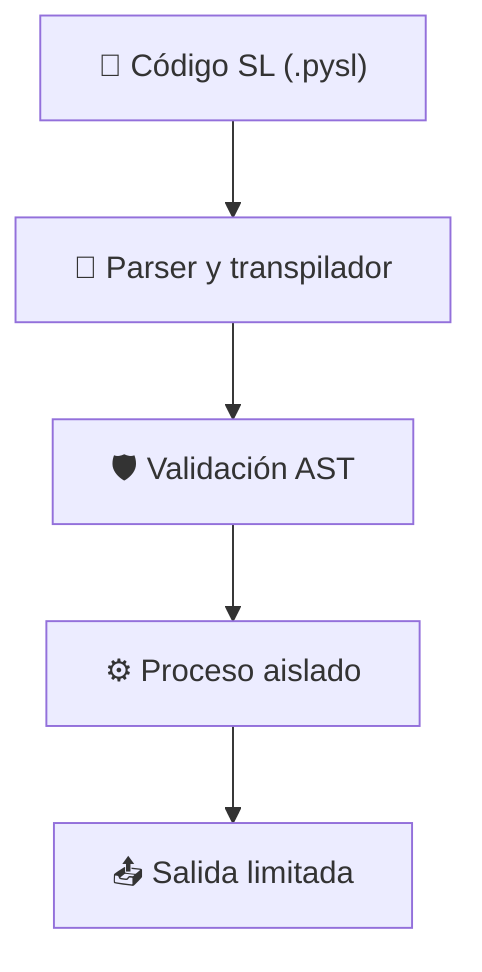

<p align="center">
  
</p>

<p align="center">
  
</p>

<p align="center">
  <strong>Plataforma educativa de escritorio para aprender programación estructurada con SL y relacionarla con Python.</strong>
</p>

<p align="center">
  <a href="https://github.com/Jairo0811/PySL/actions/workflows/ci.yml"></a>
  
  
  
  
</p>


> **📌 Nomenclatura oficial:** PySL es la plataforma. SL y Python son los lenguajes. El conversor trabaja en las direcciones **SL → Python** y **Python → SL**.

## 📚 ¿Qué es SL?

**SL (Structured Language)** es un lenguaje de programación educativo, imperativo, estructurado y de alto nivel, orientado a la enseñanza de algoritmos y programación estructurada. Su sintaxis prioriza la claridad mediante construcciones como `inicio`, `fin`, `si`, `mientras`, `para`, `funcion`, `leer` e `imprimir`.

Los programas SL utilizados por la plataforma se guardan con la extensión `.pysl` para conservar la compatibilidad histórica del proyecto.

## 🖥️ ¿Qué es PySL?

**PySL** es una plataforma educativa de escritorio desarrollada con Python y PySide6. Incluye un IDE para programas SL, runtime seguro, conversor bidireccional **SL ↔ Python**, curso, laboratorios, juegos, documentación integrada y persistencia local con SQLite.

PySL no es un lenguaje de programación. Python es el lenguaje de propósito general utilizado como referencia y como destino u origen del conversor.

## ✨ Funcionalidades

| Área | Capacidades |
|---|---|
| 🖥️ IDE de SL | Editor `.pysl`, numeración de líneas, resaltado, abrir, guardar, ejecutar y consola |
| 📘 Lenguaje SL | Variables, entrada/salida, decisiones, ciclos, vectores y funciones |
| 🛡️ Runtime | Validación AST, proceso aislado, llamadas autorizadas y límites de recursos |
| 🔄 Conversor | **SL → Python** y **Python → SL** para el subconjunto educativo documentado |
| 🎓 Aprendizaje | Curso integrado, laboratorio del menor número par y ejemplos ejecutables |
| 🎮 Juegos | Ahorcado, adivina el número, piedra/papel/tijera y tres en raya |
| 💾 Datos | Progreso, estadísticas y preferencias persistentes con SQLite |
| 🧭 Experiencia | Login demostrativo local, dashboard, perfil, galería, configuración y documentación |

## 🛡️ Seguridad del runtime de SL

Cada programa pasa por esta cadena antes de ejecutarse:


```mermaid
flowchart TD
    A["📄 Código SL (.pysl)"] --> B["🔎 Parser y transpilador"]
    B --> C["🛡️ Validación AST"]
    C --> D["⚙️ Proceso aislado"]
    D --> E["📤 Salida limitada"]
```

El runtime:

- 🔒 no expone los `builtins` generales de Python;
- 🚫 rechaza imports, atributos, acceso al sistema y llamadas no autorizadas;
- 🧾 reserva los nombres internos y valida tipos y tamaños de valores;
- ⏱️ limita tiempo, pasos, iteraciones, entrada, salida, nodos AST y tamaño numérico;
- 🧠 aplica límite de memoria mediante el sistema operativo cuando está disponible;
- 🛑 finaliza el proceso aislado si el programa no responde;
- 🧵 se invoca desde un worker de Qt para mantener la interfaz fluida.

Este aislamiento está diseñado para ejercicios educativos locales. No debe utilizarse como sandbox para ejecutar código hostil de terceros. Consulta [docs/SEGURIDAD.md](docs/SEGURIDAD.md).

## 🔄 Conversor SL ↔ Python

### 📘 SL → Python

```text
inicio
leer(nombre)
imprimir("Hola", nombre)
fin
```

```python
nombre = __leer__()
__imprimir__("Hola", nombre)
```

### 🐍 Python → SL

```python
for numero in range(1, 4):
    if numero % 2 == 0:
        print("par", numero)
```

```text
inicio
    para numero desde 1 hasta (4) - 1
        si numero % 2 == 0 entonces
            imprimir("par", numero)
        finsi
    finpara
fin
```

Python → SL analiza el AST y rechaza construcciones sin equivalente soportado. No copia código Python arbitrario dentro de un archivo SL.

## 🏗️ Arquitectura

```text
src/pysl/
├── core/       ⚙️ Configuración, sesión, errores globales y SQLite
├── language/   📘 Parser/transpilador, validación AST y ejecución aislada
├── modules/    🧩 Casos de uso y vistas organizados por funcionalidad
├── runtime/    ▶️ Utilidades educativas para ejemplos de consola
├── ui/         🖥️ Ventana principal y estilos compartidos
└── app.py      🚀 Composición y punto de entrada
```

La interfaz no ejecuta código SL directamente: delega en el servicio de lenguaje, que valida y crea un proceso con recursos acotados. La persistencia reside fuera del directorio de instalación para conservar los datos durante actualizaciones.

Más detalles en [docs/ARQUITECTURA.md](docs/ARQUITECTURA.md).

## 🧰 Stack tecnológico

### 🐍 Lenguaje, interfaz y persistencia

<p align="center">
  
</p>

<p align="center">
  
  
  
</p>

### 🧪 Calidad, pruebas y distribución

<p align="center">
  
</p>

<p align="center">
  
  
  
  
</p>

### 🛠️ Desarrollo y control de versiones

<p align="center">
  
</p>

<p align="center">
  
  
  
  
</p>

| Categoría | Tecnología |
|---|---|
| 🐍 Plataforma | Python 3.12+ |
| 🖥️ Interfaz | PySide6 / Qt 6 |
| 💾 Persistencia | SQLite |
| 🧪 Pruebas | Pytest |
| ✅ Calidad | Ruff |
| 📦 Distribución | PyInstaller |
| ⚙️ Automatización | GitHub Actions |
| 🛠️ Desarrollo | Visual Studio Code, Git y GitHub |

## 🚀 Instalación para desarrollo

```powershell
git clone https://github.com/Jairo0811/PySL.git
cd PySL
py -3.13 -m venv .venv
.\.venv\Scripts\Activate.ps1
python -m pip install --upgrade pip
python -m pip install -e ".[dev,build]"
```

> 🐧 En Linux o macOS, activa el entorno con `source .venv/bin/activate`.

## ▶️ Uso

```powershell
python -m pysl.app
```

## 🔑 Credenciales predeterminadas

| Campo | Valor |
|---|---|
| 👤 Usuario | `Jairo` |
| 🔐 Contraseña | `pysl2026` |

Estas credenciales pertenecen exclusivamente a la cuenta local de demostración. La aplicación compara la contraseña mediante PBKDF2 y no la almacena en texto plano. También puedes usar **Continuar como invitado** para explorar PySL sin introducir credenciales. Este acceso no representa un sistema de identidad para producción.

Los ejemplos se encuentran en [`examples/`](examples/):

- 👋 `hola_mundo.pysl`;
- 🔁 `condicional_y_ciclo.pysl`;
- 🧩 `funciones_y_vectores.pysl`.

## 🧪 Calidad y pruebas

```powershell
python -m ruff check .
python -m ruff format --check .
python -m pytest
python -m compileall -q src
```

La suite contiene **31 pruebas automatizadas** que cubren autenticación, parser/transpilador, límites del runtime, conversores, SQLite, utilidades, laboratorio y juegos. CI verifica Python 3.12 y 3.13; además genera y prueba el ejecutable en Windows.

## 📦 Distribución para Windows

```powershell
Unblock-File .\scripts\build_windows.ps1
.\scripts\build_windows.ps1
```

El script instala las dependencias, ejecuta Ruff, Pytest y `compileall`, y genera:

```text
dist\PySL\PySL.exe
```

Las versiones etiquetadas como `vMAJOR.MINOR.PATCH` publican automáticamente un GitHub Release con `PySL-Windows-x64.zip`. Consulta [docs/DISTRIBUCION.md](docs/DISTRIBUCION.md) o descarga la [última versión estable](https://github.com/Jairo0811/PySL/releases/latest).

## 📸 Capturas

| 🏠 Inicio | 🖥️ IDE de SL |
|---|---|
|  |  |

| 🔄 Conversor SL ↔ Python | 🔐 Acceso local |
|---|---|
|  |  |

Las capturas son reproducibles mediante `python scripts/capture_screenshots.py` y se verifican como artefacto de CI.

## 🎓 Origen académico

| Campo | Información |
|---|---|
| 🏫 Institución | Instituto Tecnológico de Las Américas (ITLA) |
| 📘 Materia | Fundamentos de Programación (SOF-001) |
| 📅 Período | 2016-C2 |
| 👨‍🏫 Profesor | Freidy Ramón Núñez Pérez |
| 👨‍💻 Autor | Francis Jairo Matías Rosario (2015-2984) |

La versión actual es una reingeniería del proyecto final original, preservado en `legacy/web-original/` como memoria académica.

## 📌 Estado y versionado

PySL sigue [versionado semántico](https://semver.org/lang/es/). La rama `main` representa la versión estable y el historial se documenta en [CHANGELOG.md](CHANGELOG.md).

La línea 1.x está cerrada funcionalmente. Se reservan para una eventual 2.0 el depurador paso a paso, autocompletado avanzado, proyectos multiarchivo, modo docente, internacionalización y una biblioteca estándar ampliada.

## 📜 Licencia

Distribuido bajo la [licencia MIT](LICENSE).

## 👨‍💻 Autor

**Francis Jairo Matías Rosario** · [@Jairo0811](https://github.com/Jairo0811)

<div align="center">

### 💡 Del algoritmo a la realidad.

⭐ Si este proyecto te resultó interesante, considera darle una estrella al repositorio.

</div>
