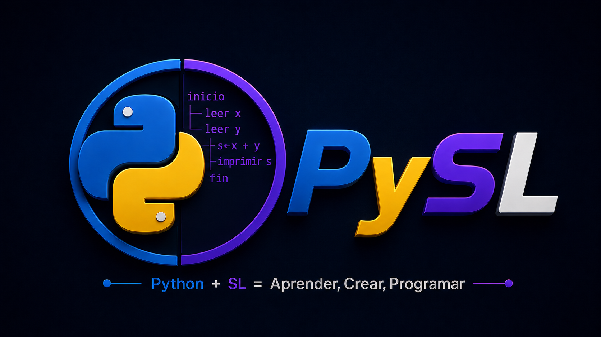

<p align="center">
  
</p>

<h1 align="center">🐍 PySL</h1>

<p align="center">
  <strong>Python + SL = Aprender, Crear, Programar</strong>
</p>

<p align="center">
  Plataforma educativa de escritorio inspirada en el lenguaje <strong>SL</strong> del Instituto Tecnológico de Las Américas (ITLA).
</p>

<p align="center">
  
  
  
  
  
</p>

---

# 📖 Descripción

**PySL** es una plataforma educativa de escritorio desarrollada en **Python** con **PySide6**, diseñada para enseñar programación estructurada mediante una sintaxis inspirada en el lenguaje **SL**, utilizado durante la asignatura **Fundamentos de Programación (SOF-001)** del **Instituto Tecnológico de Las Américas (ITLA)**.

El proyecto representa una reinterpretación moderna del trabajo final desarrollado originalmente durante el período académico **2016-C2**. La versión actual incorpora una arquitectura modular, un IDE para archivos `.pysl`, laboratorios, juegos educativos, conversión entre PySL y Python, persistencia con SQLite y documentación técnica.

> **Del algoritmo a la realidad.**

---

# 📑 Contenido

- [Descripción](#-descripción)
- [Información académica](#-información-académica)
- [Funcionalidades](#-funcionalidades)
- [Tecnologías utilizadas](#-tecnologías-utilizadas)
- [Arquitectura](#️-arquitectura)
- [Estructura del repositorio](#-estructura-del-repositorio)
- [Requisitos](#-requisitos)
- [Instalación](#-instalación)
- [Uso](#️-uso)
- [Lenguaje PySL](#-lenguaje-pysl)
- [Galería](#-galería)
- [Evolución del proyecto](#-evolución-del-proyecto)
- [Estado](#-estado-del-proyecto)
- [Roadmap](#-roadmap)
- [Licencia](#-licencia)
- [Autor](#-autor)

---

# 🏛 Información académica

| Campo | Información |
|:------|:------------|
| **Institución** | Instituto Tecnológico de Las Américas (ITLA) |
| **Autor** | Francis Jairo Matías Rosario |
| **Matrícula** | 2015-2984 |
| **Materia** | Fundamentos de Programación (SOF-001) |
| **Período académico** | 2016-C2 |
| **Profesor** | Freidy Ramón Núñez Pérez |

---

# 🚀 Funcionalidades

## 🖥️ IDE PySL

- Editor para archivos `.pysl`.
- Numeración de líneas.
- Resaltado de sintaxis.
- Apertura y guardado de archivos.
- Ejecución integrada.
- Consola de salida.

## 🐍 Lenguaje PySL

- Variables y tipos de datos.
- Entrada y salida.
- Operadores aritméticos y lógicos.
- Condicionales.
- Ciclos.
- Vectores.
- Funciones.
- Validación sintáctica.
- Ejecución mediante Runtime propio.

## 🔄 Conversor PySL ↔ Python

- Conversión educativa entre ambos lenguajes.
- Comparación de instrucciones equivalentes.
- Apoyo a la transición desde programación estructurada hacia Python.

## 📚 Curso y laboratorios

- Variables.
- Tipos de datos.
- Operadores.
- Condicionales.
- Ciclos.
- Funciones.
- Algoritmos básicos.
- Ejercicio del menor número par.

## 🎮 Juegos educativos

- Ahorcado.
- Adivina el número.
- Piedra, Papel o Tijera.
- Tres en Raya.

## 👤 Experiencia de usuario

- Login local demostrativo.
- Dashboard.
- Perfil.
- Galería histórica.
- Configuración.
- Documentación integrada.
- Progreso y preferencias persistentes mediante SQLite.

---

# 🧰 Tecnologías utilizadas

## 🖥️ Aplicación de escritorio

<p>
  
</p>

- **Python 3.13:** lenguaje principal del proyecto.
- **PySide6 (Qt):** interfaz gráfica, navegación, editor y componentes visuales.

## 🗄️ Persistencia

<p>
  
</p>

- **SQLite:** perfiles, preferencias, progreso y configuración local.

## 🧪 Calidad y distribución

- **Pytest:** pruebas automatizadas.
- **Ruff:** análisis estático y calidad del código.
- **PyInstaller:** generación del ejecutable para Windows.

## 🌿 Desarrollo y control de versiones

<p>
  
</p>

- **Visual Studio Code:** entorno principal de desarrollo.
- **Git:** control de versiones.
- **GitHub:** publicación, documentación y seguimiento del proyecto.

---

# 🏗️ Arquitectura

PySL utiliza una arquitectura modular que separa la interfaz, la lógica del lenguaje y la persistencia.

```text
                         PySL

                +----------------------+
                |   Interfaz PySide6   |
                +----------------------+
                           │
        ┌──────────────────┼──────────────────┐
        ▼                  ▼                  ▼

   Dashboard          IDE PySL         Curso/Laboratorios
        │                  │                  │
        └──────────────┬───┴──────────────┬───┘
                       ▼                  ▼
              Transpilador/Ejecutor      Juegos
                       │
                       ▼
                 Validación AST

        +-----------------------------------------+
        | Persistencia SQLite y configuración     |
        +-----------------------------------------+
```

Esta separación reduce el acoplamiento y permite que la interfaz, el motor PySL y la persistencia evolucionen de forma independiente.

---

# 📂 Estructura del repositorio

```text
PySL
│
├── 📁 assets
│   ├── 📁 images
│   └── 📁 videos
│
├── 📁 data
│
├── 📁 docs
│   ├── ARQUITECTURA.md
│   └── SINTAXIS.md
│
├── 📁 legacy
│   └── 📁 web-original
│
├── 📁 scripts
│   └── build_windows.ps1
│
├── 📁 src
│   └── 📁 pysl
│       ├── 📁 core
│       ├── 📁 database
│       ├── 📁 modules
│       ├── 📁 runtime
│       ├── 📁 services
│       ├── 📁 ui
│       └── app.py
│
├── 📁 tests
│
├── 📄 CHANGELOG.md
├── 📄 LICENSE
├── 📄 README.md
├── 📄 pyproject.toml
└── 📄 .gitignore
```

---

# 📦 Requisitos

| Requisito | Versión |
|-----------|---------|
| 🐍 Python | 3.12 o superior; 3.13 recomendado |
| 💻 Sistema operativo | Windows 10/11; compatible con Linux y macOS para desarrollo |
| 🧠 Memoria RAM | 4 GB mínimo |
| 💾 Espacio en disco | 300 MB libres |
| 🖥️ Resolución recomendada | 1366×768 o superior |

> La aplicación y el proceso de distribución han sido probados principalmente en Windows.

---

# 🚀 Instalación

## 1. Clonar el repositorio

```bash
git clone https://github.com/Jairo0811/PySL.git
cd PySL
```

## 2. Crear el entorno virtual

### Windows

```powershell
py -3.13 -m venv .venv
.\.venv\Scripts\Activate.ps1
```

### Linux / macOS

```bash
python3 -m venv .venv
source .venv/bin/activate
```

## 3. Instalar dependencias

```powershell
python -m pip install --upgrade pip
python -m pip install -e ".[dev,build]"
```

## 4. Ejecutar pruebas

```powershell
python -m pytest
```

Resultado esperado:

```text
20 passed
```

---

# ▶️ Uso

## Ejecutar PySL

```powershell
python -m pysl.app
```

<details>
<summary>🔑 Credenciales de demostración</summary>

```text
Usuario: Jairo
Contraseña: pysl2026
```

El acceso es local y demostrativo; no representa un sistema de autenticación para producción.

</details>

## Generar el ejecutable para Windows

```powershell
Unblock-File .\scripts\build_windows.ps1
.\scripts\build_windows.ps1
```

El ejecutable se genera en:

```text
dist\PySL\PySL.exe
```

Los datos del usuario se almacenan fuera del directorio de instalación para evitar pérdidas durante futuras actualizaciones.

---

# 🐍 Lenguaje PySL

PySL implementa una sintaxis educativa inspirada en SL y utiliza Python como motor de ejecución.

## Ejemplo PySL

```text
inicio
leer(nombre)
imprimir("Hola", nombre)
fin
```

## Equivalente en Python

```python
nombre = input()
print("Hola", nombre)
```

## Construcciones soportadas

```text
inicio / fin
leer(...)
imprimir(...)
si / sino / finsi
mientras / finmientras
para / finpara
funcion / finfuncion
retornar
vectores
```

Consulta [`docs/SINTAXIS.md`](docs/SINTAXIS.md) para conocer la sintaxis completa.

---

# 📸 Galería

Las capturas finales se incorporarán en `assets/screenshots/`.

```text
🚧 Próximamente
```

Capturas previstas:

- Inicio de sesión.
- Dashboard.
- IDE PySL.
- Conversor.
- Laboratorios.
- Juegos.
- Acerca de PySL.

---

# 🚀 Evolución del proyecto

```text
Proyecto final ITLA (2016-C2)
            │
            ▼
Portal web académico
HTML + CSS + JavaScript
            │
            ▼
Reingeniería completa (2026)
            │
            ▼
PySL
Python + PySide6 + SQLite
IDE + Runtime + Conversor + Laboratorios + Juegos
```

## Mejoras principales

- Reescritura completa en Python.
- Interfaz gráfica con PySide6.
- Arquitectura modular.
- IDE propio para archivos `.pysl`.
- Transpilador y ejecutor restringido mediante AST.
- Conversor PySL ↔ Python.
- Curso y laboratorios.
- Juegos educativos.
- Persistencia con SQLite.
- Pruebas automatizadas.
- Documentación técnica.
- Script de distribución para Windows.
- Proyecto original preservado en `legacy/web-original/`.

---

# 📋 Estado del proyecto

| Componente | Estado |
|------------|--------|
| Login y dashboard | ✅ Completado |
| Perfil y configuración | ✅ Completados |
| IDE PySL | ✅ Completado |
| Runtime y validación AST | ✅ Completados |
| Conversor PySL ↔ Python | ✅ Completado |
| Curso y laboratorios | ✅ Completados |
| Juegos educativos | ✅ Completados |
| Persistencia SQLite | ✅ Implementada |
| Pruebas automatizadas | ✅ 20 superadas |
| Documentación | ✅ Completada |
| Build para Windows | ✅ Preparado |

---

# 🎯 Competencias demostradas

- Desarrollo de aplicaciones de escritorio con Python y PySide6.
- Arquitectura modular y separación de responsabilidades.
- Interpretación, transpilación y ejecución restringida de código.
- Persistencia local con SQLite.
- Testing automatizado con Pytest.
- Calidad de código con Ruff.
- Empaquetado con PyInstaller.
- Git, GitHub y documentación técnica.
- Desarrollo de software educativo.

---

# 🚀 Roadmap

## ✅ Versión 1.0

- Login y dashboard.
- IDE PySL.
- Runtime y validación AST.
- Conversor PySL ↔ Python.
- Curso y laboratorios.
- Juegos educativos.
- Persistencia SQLite.
- Documentación.
- Build para Windows.

## Posibles mejoras futuras

- Depurador paso a paso.
- Autocompletado inteligente.
- Proyectos con múltiples archivos.
- Biblioteca estándar PySL.
- Exportación de código.
- Modo docente.
- Internacionalización.

---

# 📜 Licencia

PySL se distribuye bajo la licencia **MIT**.

El proyecto fue desarrollado con fines educativos y de portafolio, tomando como referencia el proyecto final de **Fundamentos de Programación (SOF-001)** del ITLA.

Consulta el archivo [`LICENSE`](LICENSE) para más información.

---

# 🙌 Agradecimientos

- Instituto Tecnológico de Las Américas (ITLA).
- Prof. Freidy Ramón Núñez Pérez.
- Comunidad de Python.
- Proyecto Qt y PySide6.
- SQLite.
- Comunidad Open Source.

---

# 👨‍💻 Autor

## Francis Jairo Matías Rosario

**Tecnólogo en Desarrollo de Software**  
**Estudiante de Ingeniería de Software**

GitHub: [@Jairo0811](https://github.com/Jairo0811)

---

<div align="center">

# 🐍 PySL

### Python + SL = Aprender, Crear, Programar

> **Del algoritmo a la realidad.**

⭐ Si este proyecto te resultó interesante, considera darle una estrella al repositorio.

**© 2026 · Francis Jairo Matías Rosario**

</div>
