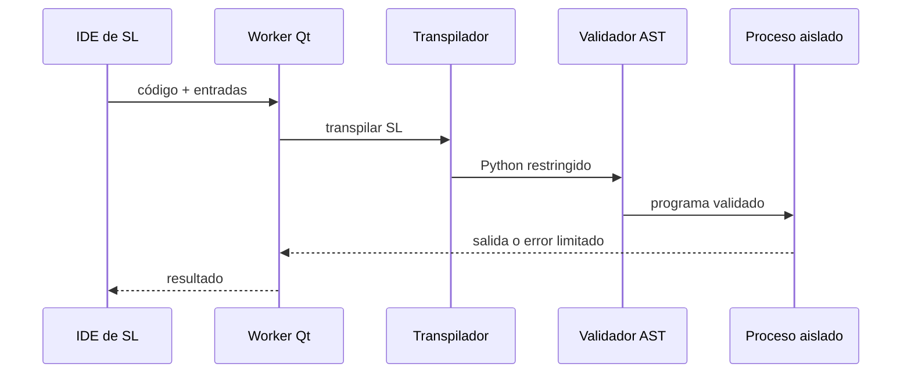

# Arquitectura de PySL

## Responsabilidades

PySL es la plataforma de escritorio. SL es el lenguaje educativo que procesa el núcleo y Python es el lenguaje de referencia del conversor y la representación intermedia restringida.

| Paquete | Responsabilidad |
|---|---|
| `core` | Configuración, rutas, sesión, SQLite, logging y errores globales |
| `language` | Parser/transpilador de SL, validación AST, aislamiento y límites |
| `modules` | Vistas y casos de uso agrupados por funcionalidad |
| `runtime` | Utilidades educativas para ejemplos de consola |
| `ui` | Ventana principal, navegación y estilos comunes |

## Flujo de ejecución de SL

El proceso hijo recibe únicamente el código Python restringido, las entradas y una estructura inmutable de límites. Su entorno no expone `__builtins__` generales. Las operaciones con potencial de crecimiento se redirigen a funciones acotadas y la comunicación regresa por una tubería de `multiprocessing`.

## Dependencias

- Las vistas dependen de servicios del mismo módulo y de contratos del núcleo.
- `language` no depende de PySide6 ni de SQLite, por lo que puede probarse aisladamente.
- `core.database` utiliza consultas parametrizadas y conexiones de vida corta.
- La composición de vistas ocurre en `DashboardView`; el punto de entrada configura Qt, logging y manejo global de errores.

## Persistencia

La base `pysl.db` reside en una carpeta escribible por usuario:

- Windows: `%LOCALAPPDATA%\PySL`;
- macOS: `~/Library/Application Support/PySL`;
- Linux: `$XDG_DATA_HOME/PySL` o `~/.local/share/PySL`.

Los recursos empaquetados se resuelven desde el proyecto durante desarrollo y desde `_MEIPASS` al ejecutar el build de PyInstaller.

## Decisiones de alcance 1.x

- Arquitectura modular por funcionalidades, sin introducir un framework adicional.
- Conversión Python → SL basada en AST y limitada a equivalencias educativas seguras.
- Ejecución en proceso separado en lugar de hilo: un hilo no puede detener con seguridad un ciclo infinito de Python.
- Persistencia SQLite local, suficiente para un único usuario de escritorio.
